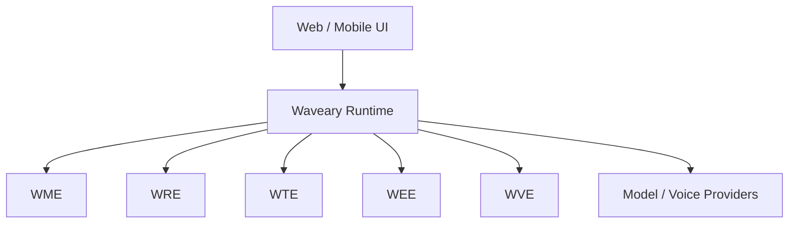

# Waveary

<div align="center">

## 回响之境 · Waveary

### 念念不忘，终有回响。

**An open source Digital Life Companion Framework**  
**一个开源数字生命陪伴框架**

[](./LICENSE)
[](https://github.com/K2st0r/Waveary/stargazers)
[](https://github.com/K2st0r/Waveary/network/members)
[](https://github.com/K2st0r/Waveary/issues)
[](https://github.com/K2st0r/Waveary/commits/main)
[](https://github.com/K2st0r/Waveary)

[Overview](#overview--项目简介) ·
[Why](#why-waveary--为什么是-waveary) ·
[Capabilities](#capabilities--当前能力) ·
[Architecture](#architecture--架构概览) ·
[Quick Start](#quick-start--快速开始) ·
[Project Route](#project-route--项目路线) ·
[Contributing](#contributing--参与贡献)

</div>

---

## Overview | 项目简介

**Waveary is an open source framework for building digital companionship with continuity.** It gives any large model a runtime layer for long-term memory, relationship growth, life timeline awareness, emotional continuity, and voice interaction.

**Waveary 是一个面向长期陪伴的开源框架。** 它为任意大模型补上长期记忆、关系成长、人生时间轴、情绪连续性与语音交互这一层运行时能力。

Waveary is not trying to create a slightly smarter chatbot. It is trying to build the infrastructure for an AI that can remember, understand, grow, and stay with a person over time.

Waveary 不是在做一个“更会答题”的聊天机器人，而是在构建一种基础设施，让 AI 可以长期记住、理解、成长，并持续陪伴一个人的生活。

---

## Why Waveary | 为什么是 Waveary

Most AI products can answer. Very few can continue.

多数 AI 产品会回答问题，但很少真的会延续关系。

What users miss is not only intelligence. It is:

- being remembered
- being understood in context
- being accompanied across real life events
- being cared for with emotional continuity

用户真正缺少的不只是“更聪明的回答”，而是：

- 被记住
- 被持续理解
- 被陪伴着经历真实生活
- 被带着情绪温度地关心

Waveary is designed to fill that gap with systems, not roleplay tricks.

Waveary 想补上的，正是这层“连续性系统”，而不是只靠提示词维持的人设幻觉。

---

## Positioning | 项目定位

### Waveary is

- a Digital Life Companion Framework
- a continuity layer for companion products
- a reusable runtime for memory, relationship, timeline, emotion, and voice
- a multi-provider foundation rather than a single-model wrapper

### Waveary 是

- 数字生命陪伴框架
- 面向陪伴产品的连续性基础层
- 一套可复用的记忆、关系、时间轴、情绪、语音运行时
- 面向多模型兼容的基础设施，而不是单模型外壳

### Waveary is not

- `AI Girlfriend`
- `AI Boyfriend`
- a prompt-only roleplay shell
- a generic chatbot skin

### Waveary 不是

- “AI 女友项目”
- “AI 男友项目”
- 只靠提示词撑起来的角色扮演壳
- 普通聊天机器人换皮

---

## Core Thesis | 核心主张

| Thesis | 中文 |
| --- | --- |
| Memory comes before model. | 记忆优先于模型。 |
| Relationship comes before features. | 关系优先于功能。 |
| Companionship comes before intelligence. | 陪伴优先于智能。 |

These three rules define the product direction and the architecture boundary of Waveary.

这三条不是口号，而是 Waveary 的产品方向与架构边界。

---

## Capabilities | 当前能力

| Area | Status | Notes |
| --- | --- | --- |
| Chat runtime | Available | Browser-first chat shell is usable |
| Multi-provider access | Available | OpenAI-compatible provider abstraction exists |
| Model discovery | Available | Provider `/models` discovery is supported |
| Long-term memory | Available baseline | Extraction, storage, retrieval scaffold exists |
| Relationship continuity | Available baseline | Stateful continuity layer exists |
| Timeline continuity | Available baseline | Timeline-aware session structure exists |
| Identity summary | Available baseline | Concept-level user and bond understanding exists |
| Emotion continuity | In progress | Companion-side emotion state is expanding |
| Voice routing | Available baseline | Dedicated voice path and provider routing exist |
| Realtime voice | In progress | Interruption-safe browser loop is underway |
| Proactive care | In progress | Decision layer exists and is being extended |

| 模块 | 状态 | 说明 |
| --- | --- | --- |
| 对话运行时 | 可用 | 浏览器优先的对话外壳已可使用 |
| 多供应商接入 | 可用 | 已有 OpenAI-compatible 抽象层 |
| 模型发现 | 可用 | 已支持供应商 `/models` 检索 |
| 长期记忆 | 基线可用 | 已具备提取、存储、检索骨架 |
| 关系连续性 | 基线可用 | 已有有状态关系层 |
| 时间轴连续性 | 基线可用 | 已有面向时间轴的会话结构 |
| 概念级身份摘要 | 基线可用 | 已能沉淀“这个人是谁、这段关系像什么” |
| 情绪连续性 | 持续建设中 | 陪伴侧情绪状态仍在扩展 |
| 语音路由 | 基线可用 | 已有独立语音路径与供应商路由 |
| 实时语音 | 持续建设中 | 正在推进可打断的浏览器实时对话 |
| 主动关怀 | 持续建设中 | 已有决策层，仍在继续完善 |

---

## Core Engines | 核心引擎

| Engine | Name | Responsibility |
| --- | --- | --- |
| `WME` | Waveary Memory Engine | Long-term memory |
| `WRE` | Waveary Relationship Engine | Relationship growth |
| `WTE` | Waveary Timeline Engine | Timeline and recall |
| `WEE` | Waveary Emotion Engine | Emotional continuity |
| `WVE` | Waveary Voice Engine | Voice interaction |

| 引擎 | 名称 | 职责 |
| --- | --- | --- |
| `WME` | Waveary Memory Engine | 长期记忆 |
| `WRE` | Waveary Relationship Engine | 关系成长 |
| `WTE` | Waveary Timeline Engine | 时间轴与回忆 |
| `WEE` | Waveary Emotion Engine | 情绪连续性 |
| `WVE` | Waveary Voice Engine | 语音交互 |

---

## Architecture | 架构概览



Waveary sits between product interfaces and model vendors. It turns short-term model interaction into long-term companion continuity.

Waveary 位于产品界面与模型供应商之间，负责把短期模型交互提升为长期陪伴连续性。

---

## Repository Structure | 仓库结构

```text
waveary/
  waveary-core
  waveary-memory
  waveary-voice
  waveary-web
  waveary-dataset
  docs
```

Current module roles:

- `waveary-core`: runtime orchestration, provider abstraction, stateful continuity
- `waveary-memory`: memory extraction, storage, retrieval
- `waveary-voice`: voice adapters and voice runtime path
- `waveary-web`: official web surface
- `waveary-dataset`: markdown-first companion soul and conversation rules

当前模块分工：

- `waveary-core`：运行时编排、供应商抽象、连续性状态层
- `waveary-memory`：记忆提取、存储与检索
- `waveary-voice`：语音适配器与语音运行时链路
- `waveary-web`：官方 Web 产品界面
- `waveary-dataset`：以 Markdown 为主的陪伴灵魂与对话规则

---

## Quick Start | 快速开始

### Requirements | 环境要求

- `Node.js 20+`
- `npm 10+`

### Install | 安装

```bash
git clone https://github.com/K2st0r/Waveary.git
cd Waveary
npm install
```

### Run the web app | 启动 Web 界面

```bash
npm run web:dev
```

### Build | 构建

```bash
npm run web:build
```

### Test | 测试

```bash
npm run test
```

### Verify provider integration | 验证供应商接入

```bash
npm run verify:provider
```

---

## Usage Flow | 使用流程

1. Choose a provider.
2. Enter the base URL and API key.
3. Discover available models from the provider.
4. Select the model you want to use.
5. Start a conversation with memory, relationship, timeline, emotion, and voice layered on top.

1. 选择供应商。
2. 填写 Base URL 与 API Key。
3. 从供应商检索可用模型。
4. 选择你要使用的模型。
5. 开始一段具备记忆、关系、时间轴、情绪与语音能力的对话。

---

## Project Route | 项目路线

Waveary is being built as a layered system, not as a one-shot app shell.

Waveary 的推进方式不是一次性堆满功能，而是一层一层把长期陪伴系统做出来。

### V0.1

- Chat
- Long-term memory
- Timeline
- Relationship growth

### V0.2

- Voice
- Emotion analysis
- Proactive care

### V0.3

- Realtime voice
- Interruption handling
- Full duplex conversation

Long term, Waveary aims to become the continuity and life-memory layer for large models.

从更长远看，Waveary 想成为所有大模型的“人格连续性层”和“人生记忆层”。

---

## Documentation | 文档

- [Project State](./PROJECT_STATE.md)
- [Vision](./docs/vision.md)
- [Architecture](./docs/architecture.md)
- [Product Invariants](./docs/product-invariants.md)
- [Product Preferences](./docs/product-preferences.md)
- [Web Surface](./waveary-web/README.md)

---

## Contributing | 参与贡献

Issues, architecture discussion, feature proposals, and focused pull requests are welcome.

欢迎提交 issue、架构讨论、功能提案与聚焦明确的 pull request。

If you want to contribute:

1. Fork the repository.
2. Create a branch.
3. Make one focused change.
4. Open a pull request.

如果你想参与贡献：

1. Fork 仓库。
2. 新建分支。
3. 完成一个聚焦明确的改动。
4. 发起 pull request。

---

## License | 许可证

This project is released under the [MIT License](./LICENSE).

本项目基于 [MIT License](./LICENSE) 开源。
